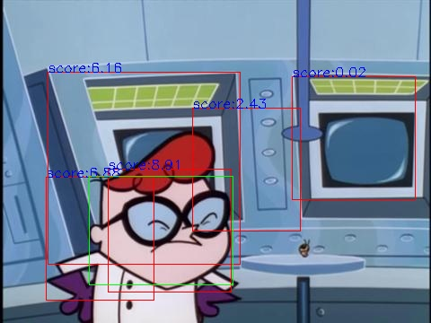

# Dexter's Laboratory - Facial Detection 🔬

## 📋 Project Overview
This project implements a **facial detection** system for characters from "Dexter's Laboratory" animated series. The system detects and localizes character faces in images using classical computer vision techniques.

## 🎯 Problem Statement
Given images from Dexter's Laboratory:
1. **Detect all character faces** in the image
2. **Provide bounding boxes** with confidence scores
3. **Handle different face shapes** and orientations

## 🔧 Implementation

### 🔍 Data Preprocessing:
- **Smart Cropping**: extracts face regions with 10-pixel margin around bounding boxes
- **Aspect Ratio Classification**: categorizes faces into three types:
  - **Horizontal** (w/h > 1.2): DeeDee's wide face → 96×84 pixels
  - **Vertical** (w/h < 0.8): Dad's tall face → 84×96 pixels  
  - **Square** (0.8 ≤ w/h ≤ 1.2): Dexter's face → 96×96 pixels
- **Data Augmentation**: increases dataset size using horizontal flip, rotation, and perspective transforms using **Albumentations** library 

### 📊 HOG (Histogram of Oriented Gradients):
**What is HOG?** Feature descriptor that captures edge and shape information by:
- Dividing image into small cells (6×6 pixels)
- Computing gradient directions for each pixel
- Creating histograms of gradient orientations (9 bins, 0°-180°)
- Normalizing over larger blocks (2×2 cells) for lighting invariance

**HOG Pipeline:**
- **Preprocessing**: CLAHE contrast enhancement, gamma correction, Gaussian blur, normalization
- **Feature Extraction**: 9 orientations, 6×6 pixel cells, 2×2 cell blocks
- **Descriptor Generation**: flattened feature vector for each face type

### 🤖 SVM Classification:
- **Linear SVM**: separates data using hyperplane with maximum margin
- **Training**: positive examples (face crops) vs negative examples (random patches)
- **Hyperparameter Tuning**: grid search over regularization parameter C (10⁻⁵ to 10⁰)
- **Multi-Model Approach**: separate SVM for each face dimension (horizontal, vertical, square)

### 🔍 Detection Pipeline:
- **Sliding Window**: systematically scans test images at multiple positions
- **Multi-Scale Detection**: processes images at different scales (0.7, 0.56, 0.45, ...)
- **HOG Extraction**: computes descriptors for each window position
- **SVM Classification**: scores each window using trained models
- **Threshold Filtering**: keeps detections above confidence threshold

### 🎯 Non-Maximal Suppression (NMS):
**What is NMS?** Removes overlapping detections to keep only the best ones
- **IoU Calculation**: measures overlap between bounding boxes
- **Score Ranking**: sorts detections by confidence scores
- **Suppression Logic**: removes boxes with IoU > 0.4 and lower scores
- **Center Point Check**: eliminates detections with centers inside higher-scoring boxes

        

## 📈 Results
- **Average Precision**: 57.5% on test dataset

## Technologies Used 💻
- **Python** 🐍
- **OpenCV** - Image processing
- **scikit-learn** - SVM implementation  
- **scikit-image** - HOG extraction
- **Albumentations** - Data augmentation

## Key Technical Concepts 🧠
- **HOG Features**: Gradient-based descriptors for shape detection
- **SVM Classification**: Maximum margin binary classifier
- **Sliding Window**: Exhaustive spatial search method
- **Multi-Scale Detection**: Object detection across different sizes
- **Non-Maximal Suppression**: Duplicate removal algorithm
