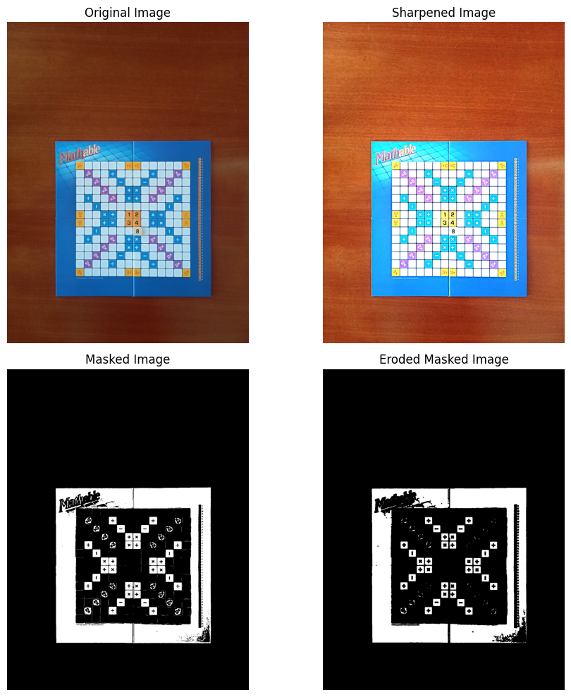
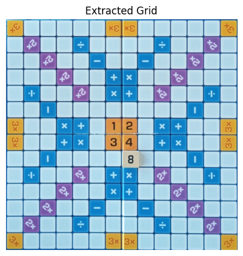
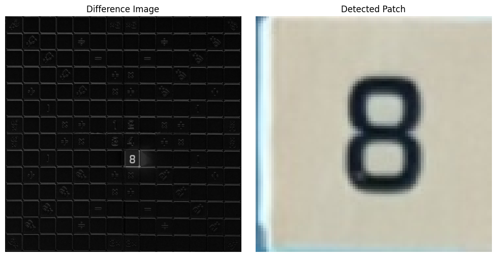
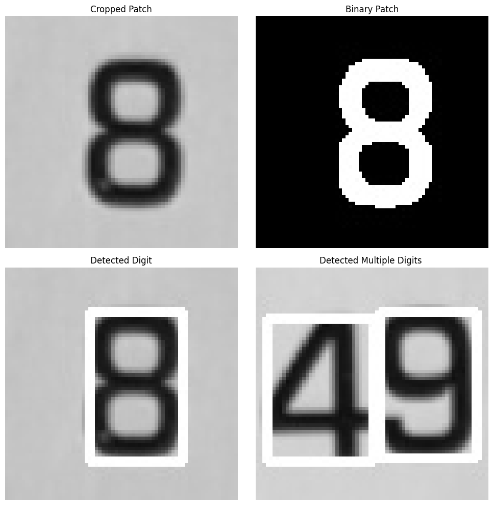

# Mathable Game - Automatic Score Calculator 🎮

## 📋 Project Overview
This project implements a comprehensive computer vision system for automatically detecting game pieces and calculating scores in the Mathable board game. Mathable is a number-based strategy game where players form mathematical equations on a 14×14 grid board, similar to Scrabble but using numbers instead of letters.

The system processes images of the game board after each move, detects newly placed pieces, recognizes the numbers on them, and automatically calculates player scores based on game rules.

## 🎯 Problem Statement
Given sequential images of a Mathable game board:
1. **Detect the position** where a new piece was placed
2. **Recognize the number** on the placed piece
3. **Calculate the score** for the current move based on game rules

## 🔧 Implementation

### 🔍 Image Preprocessing:
- **Image Resizing**: shrinks the image by 50% to speed up processing
- **Median Filtering**: reduces salt-and-pepper noise by replacing each pixel with the median of surrounding pixels
- **Gaussian Blur**: smooths the image for better edge and feature detection
- **Image Sharpening**: enhances the edges by contrasting the results of the previously applied filters
- **HSV Color Space**: is more robust for color-based segmentation than RGB
- **Color Range Masking**: isolates blue game board from background
- **Morphological Operations**: *erosion* is applied for noise removal and mask refinement
- **Contour Detection**: finds board boundaries using connected components
- **Bounding Rectangle**: determines minimal enclosing rectangle
- **Precise Cropping**: removes the blue margins of the game board
- **Grid Standardization**: resizes to fixed 1260x1260 pixels (14x14 cells, 90x90 each) for further actions

         

### 📍 Piece Placement Detection
- **Frame Differencing**: the absolute difference between two consecutive images is computed and converted to grayscale, highlighting the changes introduced by the new piece
- **Cell Scanning**: the difference image is divided into grid cells, and each cell is analyzed for its mean intensity. The cell with the highest mean intensity indicated the location of the new piece.
- **Patch Extraction**: the identified cell's region is cropped from the second image for further analysis.

  
### 🔢 Digit Recognition
- **Preprocessing**: the extracted patch is cropped to remove border noise, converted to grayscale, and binarized using thresholding (threshold=120) to enhance digit visibility
- **Contour Detection**: identifies potential digit regions in the binary image using `cv.findContours()` with `RETR_EXTERNAL` to find outer boundaries only
- **Size Filtering**: removes small contours (noise) by applying minimum size constraints (height > 20px, width > 10px) to keep only valid digit regions
- **Region Extraction**: sorts detected digit regions by horizontal position (left-to-right) to ensure correct digit order for multi-digit numbers
- **Template Matching**: each digit region is compared against pre-stored digit templates (0-9) using **Normalized Cross-Correlation** (`TM_CCOEFF_NORMED`)
- **Classification**: the template with the highest correlation score identifies the digit, with dynamic resizing to match template dimensions
- **Multi-digit Handling**: for numbers like "42" or "17", individual digits are processed separately then concatenated to form the complete number

### 🏆 Score Calculation
- **Base Score**: each piece has a base value equal to the number displayed on it
- **Bonus Multipliers**: detects special board squares that modify the score:
  - **2x squares** (purple): double the piece value
  - **3x squares** (orange): triple the piece value
- **Equation Validation**: checks if placing the piece completes valid mathematical equations by:
  - Scanning in 4 directions (up, down, left, right) from the placed piece
  - Finding pairs of adjacent numbers that can form equations with the new piece
  - Validating operations (+, -, ×, ÷) based on blue constraint squares
- **Multiple Equation Bonus**: if one piece completes multiple equations simultaneously, the score is multiplied by the number of equations formed
- **Final Score Formula**: `Base Value × Bonus Multiplier × Number of Equations`
- **Game State Update**: the matrix representing the board is updated with the new piece, and player scores are tracked across rounds
- **Turn Management**: uses turn data files to determine which player made each move and accumulates scores per round

## Technologies Used 💻
- **Python** 🐍
- **OpenCV** 🖼️
- **NumPy** 📊
